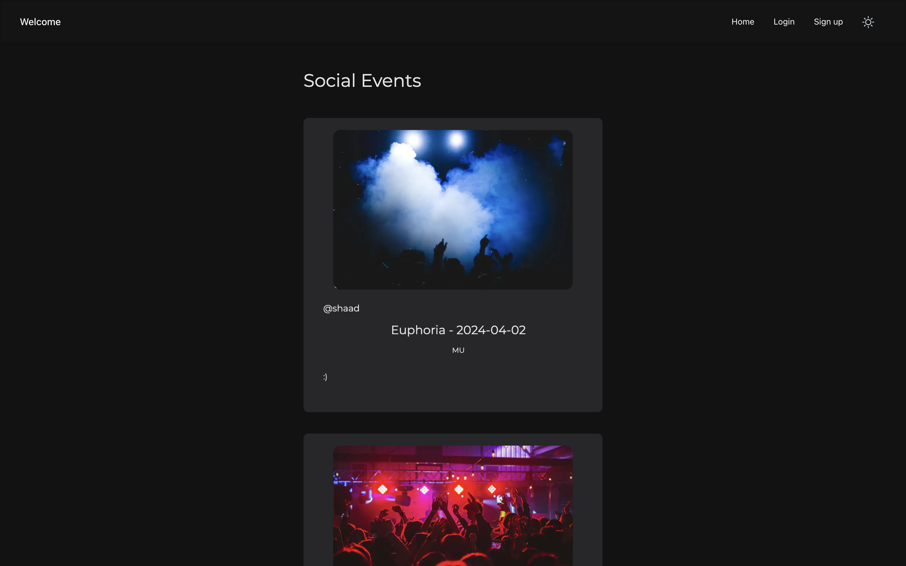

# Social Events

## Preview
<div align="center">
    
</div>

#
__This is a full stack project created using _NextJS_, _Bun_, _KindeAuth_, _AWS S3_ and _PostgreSQL_.__

_Originally created using the python based web framework Django_

## Getting Started

Clone project
```zsh
$ git clone <insert_here>
```

Install dependencies
```zsh
$ nvm use 20.9.0

$ npm install

or

$ bun install
```

Run in Development
```zsh
$ npm run dev

or 

$ bun run dev

```

## PostgreSQL Schema
```Posts Table
CREATE TABLE posts (
    id SERIAL PRIMARY KEY,
    kindeAuthId TEXT NOT NULL,
    kindeAuthName TEXT NOT NULL,
    title TEXT NOT NULL,
    caption TEXT NOT NULL,
    location TEXT NOT NULL,
    event_date TEXT NOT NULL,
    created_at TIMESTAMP DEFAULT CURRENT_TIMESTAMP NOT NULL
);
```

```Media Table
CREATE TABLE media (
    id SERIAL PRIMARY KEY,
    type TEXT NOT NULL,
    user_id TEXT NOT NULL,
    post_id TEXT,
    url TEXT NOT NULL,
    created_at TIMESTAMP DEFAULT CURRENT_TIMESTAMP NOT NULL
)
```

## Note
v2 - Image Storing has been added - (Stable)